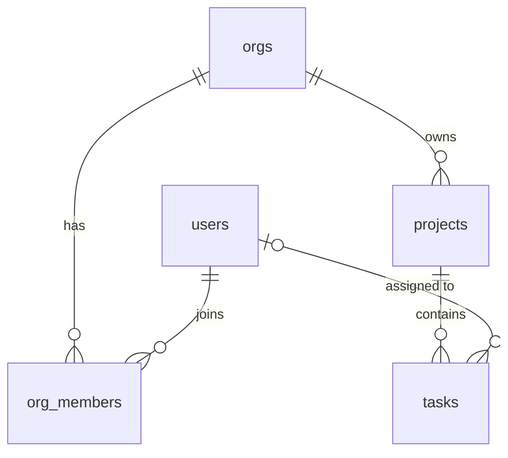

# Schema Templates

Tested on PostgreSQL 18. Adapt names and types to the domain; for PostgreSQL 17 or earlier, replace `uuidv7()` with `gen_random_uuid()` or an app-generated UUIDv7.

## Contents
- Worked example: multi-tenant project tracker (full DDL)
- Row-level security
- Text ERD
- Migration with rollback
- MongoDB collection with validation

## Worked example: multi-tenant project tracker

```sql
-- Shared trigger function: keep updated_at current on every UPDATE
CREATE OR REPLACE FUNCTION set_updated_at() RETURNS trigger
LANGUAGE plpgsql AS $$
BEGIN
  NEW.updated_at := now();
  RETURN NEW;
END;
$$;

CREATE TABLE orgs (
  id         uuid PRIMARY KEY DEFAULT uuidv7(),
  name       text NOT NULL CHECK (char_length(name) BETWEEN 1 AND 200),
  slug       text NOT NULL UNIQUE,
  created_at timestamptz NOT NULL DEFAULT now(),
  updated_at timestamptz NOT NULL DEFAULT now()
);

CREATE TABLE users (
  id         uuid PRIMARY KEY DEFAULT uuidv7(),
  email      text NOT NULL,
  full_name  text,
  created_at timestamptz NOT NULL DEFAULT now(),
  updated_at timestamptz NOT NULL DEFAULT now()
);
-- Case-insensitive uniqueness; also serves lookups by lower(email)
CREATE UNIQUE INDEX users_email_lower_key ON users (lower(email));

CREATE TABLE org_members (
  org_id     uuid NOT NULL REFERENCES orgs (id) ON DELETE CASCADE,
  user_id    uuid NOT NULL REFERENCES users (id) ON DELETE CASCADE,
  role       text NOT NULL DEFAULT 'member' CHECK (role IN ('owner', 'admin', 'member')),
  created_at timestamptz NOT NULL DEFAULT now(),
  PRIMARY KEY (org_id, user_id)
);
-- The PK serves "members of an org"; this serves "orgs for a user"
CREATE INDEX idx_org_members_user ON org_members (user_id);

CREATE TABLE projects (
  id         uuid PRIMARY KEY DEFAULT uuidv7(),
  org_id     uuid NOT NULL REFERENCES orgs (id) ON DELETE CASCADE,
  name       text NOT NULL,
  created_at timestamptz NOT NULL DEFAULT now(),
  updated_at timestamptz NOT NULL DEFAULT now(),
  UNIQUE (org_id, name),
  UNIQUE (id, org_id)          -- target for the composite FK from tasks
);

CREATE TABLE tasks (
  id          uuid PRIMARY KEY DEFAULT uuidv7(),
  org_id      uuid NOT NULL,
  project_id  uuid NOT NULL,
  assignee_id uuid REFERENCES users (id) ON DELETE SET NULL,
  title       text NOT NULL CHECK (char_length(title) BETWEEN 1 AND 500),
  status      text NOT NULL DEFAULT 'todo' CHECK (status IN ('todo', 'in_progress', 'done')),
  due_at      timestamptz,
  created_at  timestamptz NOT NULL DEFAULT now(),
  updated_at  timestamptz NOT NULL DEFAULT now(),
  -- Keeps tasks.org_id consistent with the project's org
  FOREIGN KEY (project_id, org_id) REFERENCES projects (id, org_id) ON DELETE CASCADE
);
-- Main screen: open tasks for a project by due date
CREATE INDEX idx_tasks_project_due_open ON tasks (project_id, due_at) WHERE status <> 'done';
-- "My tasks" view and the ON DELETE SET NULL from users
CREATE INDEX idx_tasks_assignee ON tasks (assignee_id) WHERE assignee_id IS NOT NULL;
-- RLS policies filter by org
CREATE INDEX idx_tasks_org ON tasks (org_id);

CREATE TRIGGER orgs_updated_at     BEFORE UPDATE ON orgs     FOR EACH ROW EXECUTE FUNCTION set_updated_at();
CREATE TRIGGER users_updated_at    BEFORE UPDATE ON users    FOR EACH ROW EXECUTE FUNCTION set_updated_at();
CREATE TRIGGER projects_updated_at BEFORE UPDATE ON projects FOR EACH ROW EXECUTE FUNCTION set_updated_at();
CREATE TRIGGER tasks_updated_at    BEFORE UPDATE ON tasks    FOR EACH ROW EXECUTE FUNCTION set_updated_at();
```

Query-to-index map for this schema:

| Query | Served by |
|---|---|
| Open tasks for a project by due date | `idx_tasks_project_due_open` (partial) |
| Tasks assigned to me | `idx_tasks_assignee` |
| Members of an org | `org_members` primary key `(org_id, user_id)` |
| Orgs a user belongs to | `idx_org_members_user` |
| Look up user by email | `users_email_lower_key` (query with `lower(email) = lower($1)`) |
| Project by name within an org | `UNIQUE (org_id, name)` |

## Row-level security

Needed whenever clients reach the database directly (always on Supabase).

```sql
ALTER TABLE tasks ENABLE ROW LEVEL SECURITY;

-- Members of the task's org can read and write its tasks.
-- current_setting('app.user_id') is set per request by the app; on Supabase use (select auth.uid()).
CREATE POLICY tasks_member_access ON tasks
  FOR ALL
  USING (EXISTS (
    SELECT 1 FROM org_members m
    WHERE m.org_id = tasks.org_id
      AND m.user_id = (select current_setting('app.user_id', true)::uuid)
  ))
  WITH CHECK (EXISTS (
    SELECT 1 FROM org_members m
    WHERE m.org_id = tasks.org_id
      AND m.user_id = (select current_setting('app.user_id', true)::uuid)
  ));
```

Repeat for each tenant-scoped table. Policies that only allow reads need just `USING`; split `FOR ALL` into per-operation policies when roles differ (for example only `owner`/`admin` may delete).

## Text ERD

```
orgs  ──1:N──  projects  ──1:N──  tasks
orgs  ──N:M──  users     (via org_members, with role)
users ──1:N──  tasks     (assignee, optional)
```

Or as Mermaid, which renders on GitHub:



## Migration with rollback

Keep each migration small, and put `CONCURRENTLY` index builds in their own migration because they cannot run inside a transaction.

```sql
-- migrations/0007_add_task_priority.up.sql
BEGIN;
SET LOCAL lock_timeout = '5s';
ALTER TABLE tasks
  ADD COLUMN priority smallint NOT NULL DEFAULT 2 CHECK (priority BETWEEN 1 AND 4);
COMMIT;

-- migrations/0008_index_task_priority.up.sql  (no transaction)
CREATE INDEX CONCURRENTLY idx_tasks_project_priority_open
  ON tasks (project_id, priority) WHERE status <> 'done';
```

```sql
-- migrations/0008_index_task_priority.down.sql  (no transaction)
DROP INDEX CONCURRENTLY IF EXISTS idx_tasks_project_priority_open;

-- migrations/0007_add_task_priority.down.sql
-- Destructive: drops priority values. Back up first if they matter.
BEGIN;
SET LOCAL lock_timeout = '5s';
ALTER TABLE tasks DROP COLUMN IF EXISTS priority;
COMMIT;
```

If a `CREATE INDEX CONCURRENTLY` fails partway, it leaves an `INVALID` index; drop it and retry.

## MongoDB collection with validation

Design from access patterns: embed data read together and bounded in size, reference data that is shared or grows without limit.

```javascript
db.createCollection("tasks", {
  validator: {
    $jsonSchema: {
      bsonType: "object",
      required: ["orgId", "projectId", "title", "status", "createdAt"],
      properties: {
        orgId:     { bsonType: "objectId" },
        projectId: { bsonType: "objectId" },
        title:     { bsonType: "string", minLength: 1, maxLength: 500 },
        status:    { enum: ["todo", "in_progress", "done"] },
        assignee:  {  // embedded snapshot for list views; source of truth is users
          bsonType: "object",
          properties: { userId: { bsonType: "objectId" }, name: { bsonType: "string" } }
        },
        dueAt:     { bsonType: "date" },
        createdAt: { bsonType: "date" }
      }
    }
  }
});

// Equality, then sort, then range (the ESR rule)
db.tasks.createIndex({ projectId: 1, status: 1, dueAt: 1 });
db.tasks.createIndex({ "assignee.userId": 1, dueAt: 1 });
```
