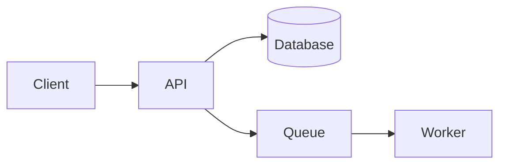

# Documentation Templates

Pick the template that matches the document type, fill it with verified facts, and delete sections that do not apply.

## Contents
- README
- Tutorial
- How-to guide
- User guide
- Architecture / explanation
- Troubleshooting guide
- Runbook / SOP
- Release notes
- Knowledge base article

## README

````markdown
# [Project name]

[One sentence: what it is and who it is for.]

## Quickstart
```bash
[install command]
[minimal run command]
```
[What you should see.]

## Features
- [Capability, in user terms]

## Installation
[Requirements with versions, then steps.]

## Usage
[The most common task, with a real example.]

## Configuration
| Variable | Required | Default | Description |
|---|---|---|---|

## Documentation
- [Links to guides, reference, architecture]

## Contributing
[How to set up for development, run tests, open a PR.]

## License
[License name and link.]
````

## Tutorial

````markdown
# [Build / learn X]

**You will build**: [concrete result]
**Time**: [estimate]  **Level**: [Beginner / Intermediate]

## Before you start
- [Required knowledge]
- [Tools, with versions]

## 1. [First step]
[Why this step matters, one sentence.]
```[language]
[code]
```
You should see:
```
[expected output]
```

## 2. [Next step]
...

## Check your work
[How to confirm the whole thing works.]

## Next steps
[Where to go from here.]
````

Tutorials follow one path that always works. Leave out options and alternatives; link to the how-to guides for those.

## How-to guide

````markdown
# How to [accomplish goal]

[One sentence on when you need this.]

## Prerequisites
- [Access, tools, prior setup]

## Steps
1. [Action]
   ```bash
   [command]
   ```
2. [Action]
3. [Action]

## Verify
[Command or check that proves it worked.]

## Troubleshooting
**[Symptom]** - [cause and fix]
````

## User guide

````markdown
# [Product / feature] guide

## Overview
[What it does and why use it, two or three sentences.]

## Getting started
[Minimal steps to first success.]

## Key concepts
### [Concept]
[Explanation with an example.]

## Common tasks
### [Task]
1. [Step]
2. [Step]
Result: [what happens]

## Advanced
[Optional features.]

## FAQ
**[Question]**
[Answer]
````

## Architecture / explanation

````markdown
# [System] architecture

## Purpose
[What the system does, for whom, and its main constraints.]

## Overview diagram


## Components
### [Component]
- **Responsibility**: [what it owns]
- **Technology**: [stack]
- **Interfaces**: [inputs, outputs, protocols]

## Data flow
1. [Step through a typical request or job]

## Key decisions
### [Decision]
- **Context**: [the problem]
- **Choice**: [what was chosen]
- **Alternatives**: [what was rejected and why]
- **Consequences**: [trade-offs accepted]

## Operational concerns
- **Scaling**: [limits and bottlenecks]
- **Security**: [authn, authz, data protection]
- **Observability**: [logs, metrics, alerts]
````

## Troubleshooting guide

Organize by symptom, the way the reader arrives:

````markdown
# Troubleshooting [system]

## [Symptom exactly as the user sees it, such as the error message]
**Cause**: [why it happens]
**Fix**:
1. [Step]
2. [Step]
**Prevent it**: [optional]

## When to escalate
[What to collect (logs, versions, IDs) and where to send it.]
````

## Runbook / SOP

````markdown
# [Procedure name]

**When to use**: [trigger]
**Owner**: [team or role]
**Time**: [estimate]  **Risk**: [low / medium / high]

## Before you start
- [Access, approvals, backups]

## Procedure
1. [Action] - expected result: [...]
2. [Action] - expected result: [...]

## Rollback
1. [How to undo each risky step]

## After
- [Verification, notifications, ticket updates]
````

## Release notes

````markdown
# [Version] - [YYYY-MM-DD]

## Breaking changes
- [What changed, who is affected, how to migrate]

## New
- [Feature, in user terms]

## Improved
- [...]

## Fixed
- [...]

## Deprecated
- [What, replacement, removal version]
````

Put breaking changes first. Write each line for the user, not as a commit message.

## Knowledge base article

````markdown
# [Question or task in the user's words]

[Direct answer in one or two sentences.]

## Steps
1. [...]

## Related
- [Links]
````
